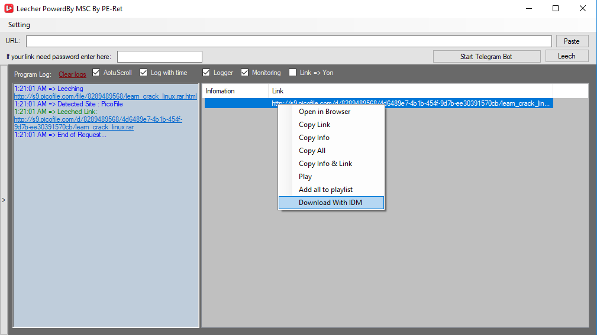
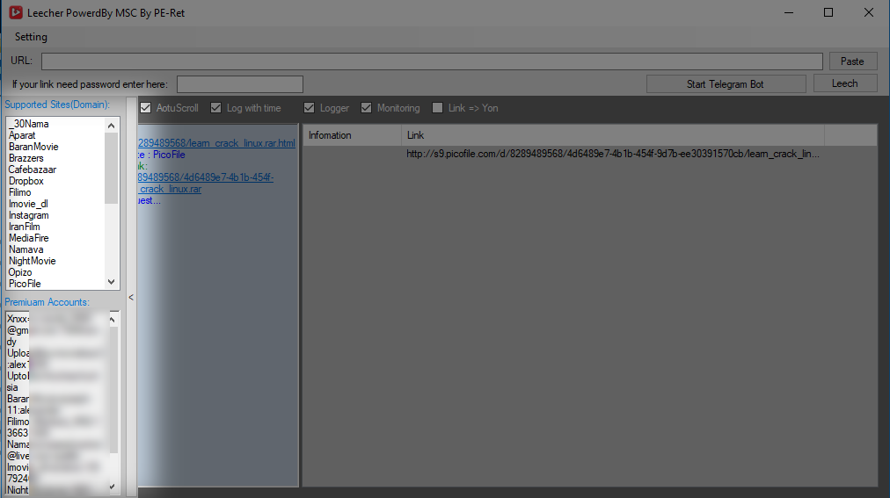
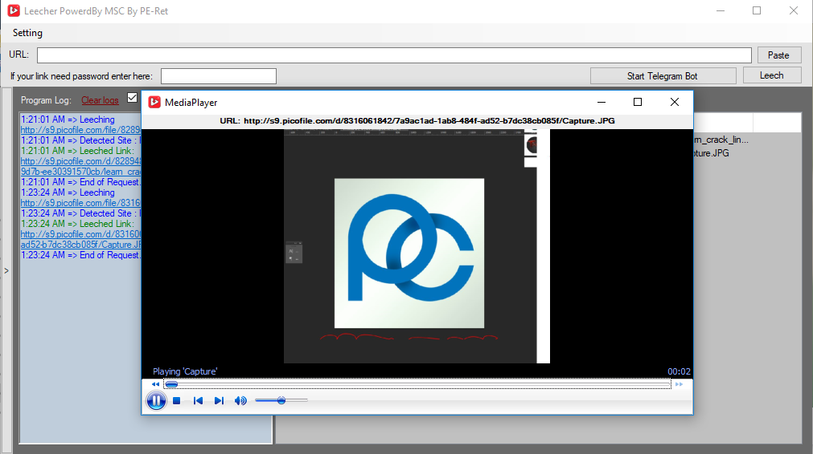

# MSCLeecher
A free leecher
- Full menu

- Account Prmium supported

- Play Leeched Media Links

# How to use
- Add DLLs to project:
- MSC.dll
- AxInterop.WMPLib.dll
- HtmlAgilityPack.dll
- NetTelegramBotApi.dll
- Newtonsoft.Json.dll
- System.Net.Http.Formatting.dll
- And compile it
# It's free but not support!
you should write your script of site and add in scripts
# How to add a Script
- Add class script in script folder
- Add type site in SiteDetecter.TypeSite
- Add Case for Get List Items Method in Core
- If your site or script need account add a account to Accounts.txt (list)
# Account list format
Email:Password:TypeSite
# Enjoy Have fun :) 
- Rextor
- [Ju$t majD]
